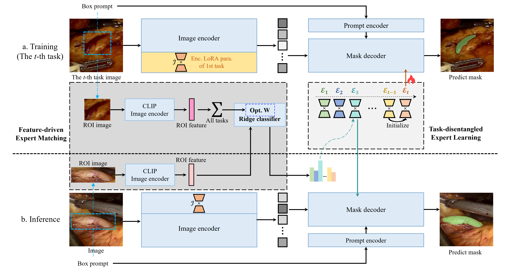

# EvoSAM

**This is the official repository for EvoSAM: Dynamically evolving segment anything model with continuous learning for medical image segmentation.**



# Installation

1. Create a virtual environment `conda create -n evosam python=3.10 -y` and activate it `conda activate evosam`
2. Install pytorch 2.0.0
3. git clone https://github.com/pgsld23333/EvoSAM.git
4. Enter the EvoSAM folder `cd EvoSAM` and run `pip install -r requirements.txt`
   
   

# Data Preparation

## 1. Download the data json files and continual learning datasets

（1）Processed data json files:  [json_files](https://drive.google.com/drive/folders/1PZYjJZUA5V4zWx_c1WGwBqK1nt4_S98S)

（2）Processed blood vessel dataset: [vessel_images.tar](https://drive.google.com/file/d/1X68_gvTDP7-iP0NqhEG8ZKa7p31nXPc8/view?usp=sharing)

（3）Processed multi-site prostate MRI dataset: will be available soon~ 


## 2. Organize data

（1）move all json files in `EvoSAM/data/json_files`

（2）move blood vessel dataset in `EvoSAM/data` and `tar -xvf vessel_images.tar`

（3）move prostate vessel dataset in `EvoSAM/data` and `tar -xvf prostate_images.tar`


# Model Preparation

1. Download [SAM checkpoint](https://dl.fbaipublicfiles.com/segment_anything/sam_vit_b_01ec64.pth) and place it at `EvoSAM/work_dir/checkpoints/sam_vit_b_01ec64.pth`

2. Download the [MedSAM checkpoint](https://drive.google.com/drive/folders/1ETWmi4AiniJeWOt6HAsYgTjYv_fkgzoN?usp=drive_link) and place it at `EvoSAM/work_dir/checkpoints/medsam_vit_b.pth`
   
   

# Run Cotinual learning Code

## 0. Command-Line Arguments Explanation

```bash
## --dataset: vessel_3task/vessel_5task/prostate
## --order: task order id, 0-5 for 3-task vessel segmentation, 0-119 for 5-task segmentation, 0-719 for multi-site prostate MRI segmentation
## -checkpoint: pretrained model checkpoint, sam_vit_b_01ec64.pth for SAM and medsam_vit_b.pth for MedSAM
```


## 1. EvoSAM

```bash
python train_evosam.py --dataset {continual_dataset} --order {task_order_id} --checkpoint {model_checkpoint}
```


## 2. Baseline Methods

```bash
## 顺序微调
python baseline_methods/train_sam_seq.py --dataset {continual_dataset} --order {task_order_id} --checkpoint {model_checkpoint}

## Distill
python baseline_methods/train_sam_distill.py --dataset {continual_dataset} --order {task_order_id} --checkpoint {model_checkpoint}

## EWC
python baseline_methods/train_sam_ewc.py --dataset {continual_dataset} --order {task_order_id} --checkpoint {model_checkpoint}

## ER(25%)
python baseline_methods/train_sam_er.py --dataset {continual_dataset} --order {task_order_id} --checkpoint {model_checkpoint}
```


The training info and the evalution results will be auto saved in `EvoSAM/work_dir/experiments`.


# Acknowledgements

1. We gratefully acknowledge the surgeons at the Chinese PLA General Hospital for their contribution in collecting the surgical blood vessel data.

2. We extend our sincere thanks to the [SAML](https://github.com/liuquande/SAML) team for making the Multi-site Dataset for Prostate MRI Segmentation publicly available. 

3. We express our gratitude to the  [MedSAM](https://github.com/bowang-lab/MedSAM) team for publicly releasing the source code and model.

4. We also thank Meta AI for publicly releasing the source code and model of [Segment Anything](https://github.com/facebookresearch/segment-anything).


